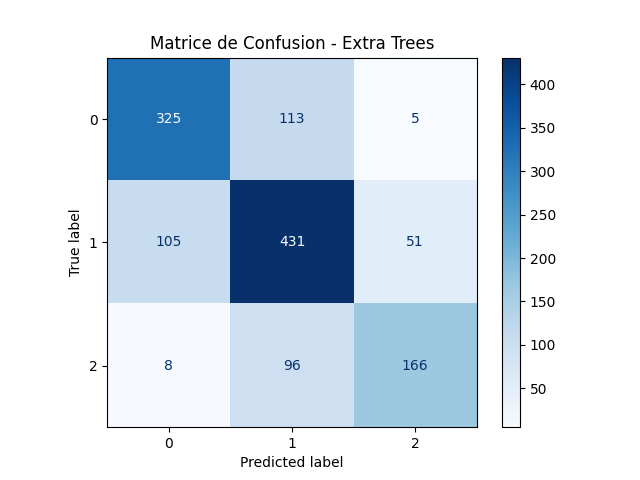
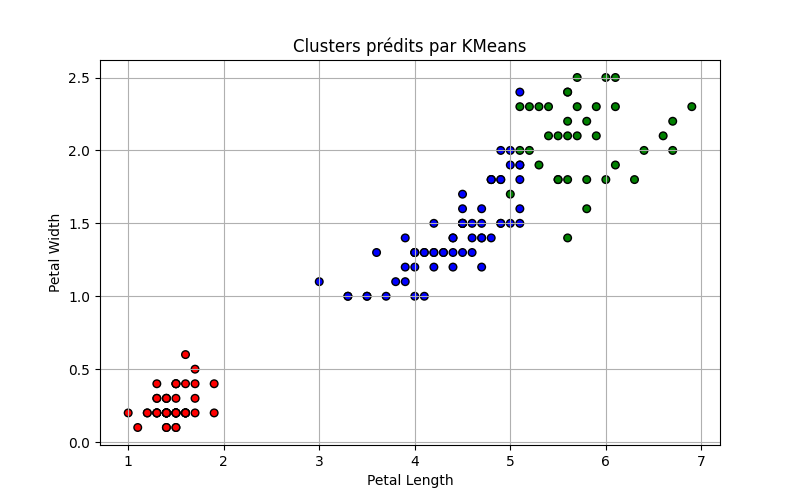
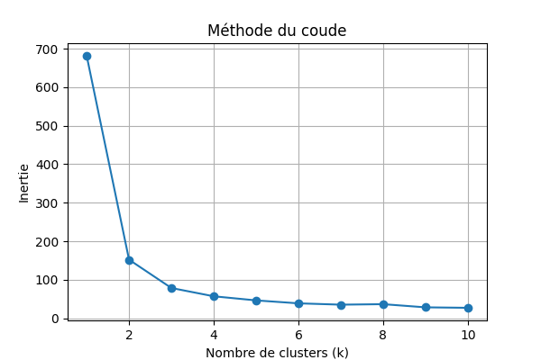
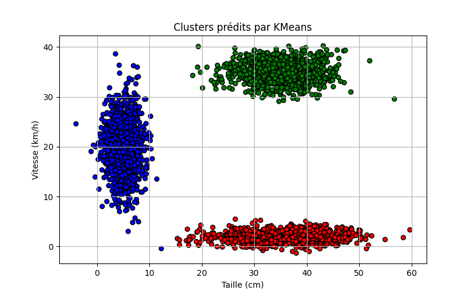

# 📚 Mes Projets Machine Learning

Bienvenue dans mon portfolio de projets Machine Learning, où j'explore différentes techniques de classification, régression et clustering appliquées à des datasets réels.

---

## 🚀 Projets inclus

### 1) 🧪 Prédiction de la qualité du vin

**Objectif** : Classification multi-classes de la qualité du vin (basse, moyenne, haute) à partir de caractéristiques chimiques.  
**Modèles testés** :  
- Régression Logistique  
- SVM  
- KNN  
- Arbre de Décision  
- Forêt Aléatoire  
- Gradient Boosting  
- Extra Trees  
- Naive Bayes  

**Meilleur modèle** : Extra Trees (Accuracy ≈ 73%)  
📓 Notebook : [`Notebooks/wine_quality_prediction.ipynb`](Notebooks/wine_quality_prediction.ipynb)

#### 🔍 Visualisations

**Matrice de Confusion du meilleur modèle (Extra Trees)**  

----

### 2) 📊 KMeans Clustering

**Objectif** : Regrouper des données sans étiquettes en fonction de leurs similarités avec l'algorithme K-Means.  
**Évaluation** : Analyse des clusters, visualisation des résultats, comparaison avec les classes réelles si disponibles.

📓 Notebook : [`Notebooks/kmeans_clustering.ipynb`](Notebooks/kmeans_clustering.ipynb)

#### 🔍 Visualisation

**Clusters générés par KMeans**  

**Méthode du coude (Elbow Method)**  

----

### 3) 🐟 Clustering de poissons avec K-Means

**Objectif**  : Regrouper différentes espèces de poissons en fonction de leurs caractéristiques physiques (taille, vitesse) à l'aide de l'algorithme K-Means.

**Méthode** :

Standardisation des données

Clustering avec KMeans(n_clusters=3)

Visualisation 2D des clusters

Évaluation via la matrice de confusion comparée aux vraies espèces

#### 🔍 Visualisation

**Clusters générés par KMeans**  

---

## ⚙️ Installation & utilisation

1. **Clone le dépôt** :

git clone git@github.com:NdongoMamoudou/ml-projects-hub.git

cd ml-projects-hub

2. **Crée et active un environnement virtuel et active le** :

python -m venv envML

3. **Installe les dépendances** :

pip install -r requirements.txt

4. **Lance le notebook** :

